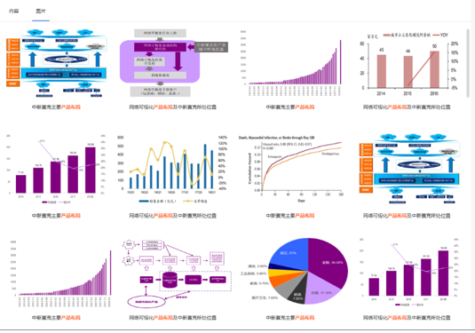
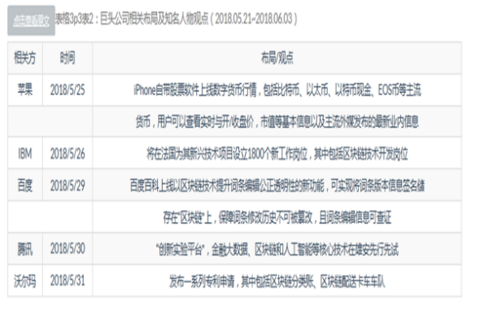

# Intelligent_Research_Report

## Introduction

 This project shows some of my related work in smart research reports from 2016 to 2018


## pdf analysis and layout analysis

We classify the pdf layout into the following categories, and use our trained layout analysis model on the test set. The results are as follows:

| 项目              | 准确率  | 召回率  |
| ----------------- | ------- | ------- |
| table             | 0.98109 | 0.93468 |
| _title            | 0.96985 | 0.90398 |
| _footer           | 0.97305 | 0.85079 |
| statistical_chart | 0.99721 | 0.99167 |
| structure_image   | 1.0     | 0.88889 |
| catalog_title     | 0.94444 | 0.89474 |
| title             | 0.8395  | 0.74    |
| table_footer      | 0.84264 | 0.75455 |
| header            | 0.99747 | 0.91647 |
| item              | 0.92683 | 0.77551 |
| catalog           | 0.82222 | 0.82222 |
| special_structure | 0.85    | 0.77    |
| table_title       | 0.95406 | 0.79882 |
| text              | 0.97468 | 0.87252 |
| footer            | 0.93964 | 0.97699 |

We use the results of layout analysis to restructure the entire article to form multiple modules such as text, tables, pictures, and picture descriptions. The article abstract is extracted from the main text, and the **article theme** is divided. Combined with a special structure, extract **analysts, ratings, target prices**, and other information. Combine pictures and picture descriptions to build a **research report picture database** and provide the function of searching pictures. 

```
For example, when we search for "产品布局" the result is to display the pictures of the designed product layout in the research article. When we click on the image, we will jump to the corresponding research article position.
```




 Combine table information for table extraction and table conversion to form **knowledge points**。


